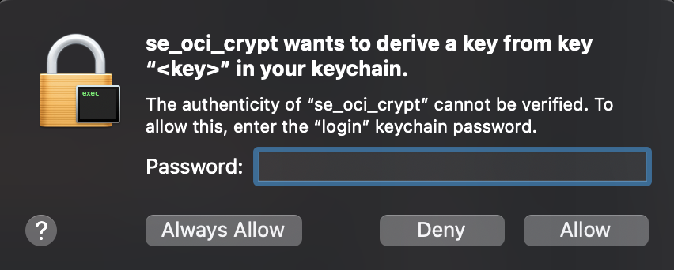

# OCICrypt Provider for Apple Keychain/Secure Enclave
> [!NOTE]
> Due to Secure Enclave access being *entitlement-gated* by Apple requiring
> code signing with a Developer ID, this repo **currently only works with 
> Apple Keychain**, their software-based key manager. However, the code written
> is intended to be [compatible](https://developer.apple.com/documentation/security/protecting-keys-with-the-secure-enclave) 
> with Secure Enclave by using **NIST P-256 Elliptic Curve** 
> -- the only key type supported by the Secure Enclave.

This repo includes a prebuilt and customizable keyprovider which can be used to encrypt OCI Containers using NIST P-256 Elliptic Curve Diffie Hellman (ECDH).

[OCICrypt](https://github.com/containers/ocicrypt) includes specifications 
to encrypt an OCI Container image and within that, the keyprovider protocol
allows wrapping of the actual key used to encrypt the layer to an external
binary.

The binary in question follows Elliptic Curve Integrated Encryption Scheme
(ECIES) and uses the P-256 public key from the Keychain/SE and performs ECDH
with an ephermal P-256 private key (created upon call to encrypt) to generate a 
shared secret. This shared secret is run through a key-derivation function
(specifically [HKDF](https://en.wikipedia.org/wiki/HKDF)) to generate the 
symmetric key that is used to encrypt the image layer itself.

This code is based off of the
[simple-oci-keyprovider](https://github.com/lumjjb/simple-ocicrypt-keyprovider)
repo and inspired by the [ocicrypt-tpm-keyprovider](https://github.com/salrashid123/ocicrypt-tpm-keyprovider/tree/v1.0.0)
repo, which demonstrates similar protocols with simple symmetric key and RSA
key encryption, respectively.

For more information, see 
- [Advancing container image security with encrypted container images](https://developer.ibm.com/articles/encrypted-container-images-for-container-image-security-at-rest/).
- [Apple Secure Enclave](https://support.apple.com/guide/security/secure-enclave-sec59b0b31ff/web)
- [Protecting Keys with the Secure Enclave](https://developer.apple.com/documentation/Security/protecting-keys-with-the-secure-enclave)

## Getting Started
Since the intention of this repo is to work with Apple's Secure Enclave/Keychain,
an Apple Device is necessary for the compilation of this code.

> [!NOTE]
> The Secure Enclave is only available on devices that either 
> [has](https://support.apple.com/en-us/103265) the T2 Security Chip or runs on
> Apple Silicon processors*

### Setup
Before we start, here are a few tools/dependecies we use:
- [docker](https://www.docker.com/get-started/)
- [skopeo](https://github.com/containers/skopeo/blob/main/install.md)
- `golang 1.19+`

#### Binaries
We first want to compile the necessary binaries to enable us to encrypt and
decrypt the images.
```sh
$ git clone git@github.com:ezh247467/ocicrypt-apple-se-keyprovider.git
$ cd ocicrypt-apple-se-keyprovider

# `starter` creates a P-256 keypair, stores it in the SE/Keychain, and writes the raw public key bytes to a `pub_key` file. 
$ clang starter.c -o starter -framework Security -framework CoreFoundation

# `delete` allows for deleting the P-256 keypair from the SE/Keychain if it deemed no longer necessary.
$ clang delete.c -o delete -framework Security -framework CoreFoundation

# Build the go binary primarily used for encryption/decryption
$ cd plugin
$ go build -o se_oci_crypt
```

#### Docker Registry
There are probably far better Docker registry setups out there, however for
quick testing, we can follow these steps.

```sh
$ docker pull registry:2
$ docker run -d -p 5001:5000 --name registry registry:2
```

We pull Docker Hub's official image (version 2) of the open source Docker
Registry software and run it locally.

> [!WARNING]
> For production use, it is critical to 
> [configure](https://labex.io/tutorials/docker-how-to-secure-a-docker-registry-with-ssl-tls-encryption-411601) 
> TLS/SSL and authentication for security. However, since we are only doing
> simple testing, I will use `--tls-verify=false` for all of our operations
> with this registry.

#### Test Environment
We now need to set up a proper test environment to encrypt and decrypt the image

```sh
# Pull a test image to encrypt/decrypt
$ docker pull alpine:latest

# Create a new tag for the test image
$ docker tag alpine:latest localhost:5001/test-alpine:latest

# Push the test image to the registry
$ docker push localhost:5001/test-alpine:latest
```

We can then ensure that our test image is now in our local Docker registry
```sh
$ curl http://localhost:5001/v2/_catalog
{"repositories":["test-alpine"]}
```
<details>
    <summary>Skopeo Inspect Version (More detailed)</summary>

```sh
$ skopeo inspect docker://localhost:5001/test-alpine:latest --tls-verify=false
{
    "Name": "localhost:5001/test-alpine",
    "Digest": "sha256:a107a3c031732299dd9dd607bb13787834db2de38cfa13f1993b7105e4814c60",
    "RepoTags": [
        "latest"
    ],
    "Created": "2025-12-03T19:30:18.252968291Z",
    "DockerVersion": "",
    "Labels": null,
    "Architecture": "amd64",
    "Os": "linux",
    "Layers": [
        "sha256:014e56e613968f73cce0858124ca5fbc601d7888099969a4eea69f31dcd71a53"
    ],
    "LayersData": [
        {
            "MIMEType": "application/vnd.oci.image.layer.v1.tar+gzip",
            "Digest": "sha256:014e56e613968f73cce0858124ca5fbc601d7888099969a4eea69f31dcd71a53",
            "Size": 3859315,
            "Annotations": null
        }
    ],
    "Env": [
        "PATH=/usr/local/sbin:/usr/local/bin:/usr/sbin:/usr/bin:/sbin:/bin"
    ]
}
```
</details>

### Encrypt
To start encrypting our test image, we first need to set up `ocicrypt` 
configurations and create a keypair to reside in the SE/Keychain.

Creating a keypair can be done through the `starter` binary. You can optionally
specify the name of the tag as an argument `./starter [tag]`. A file called
`pub_key` will be written that contains the raw public key bytes.
```sh
$ ./starter

Using tag: se.ocicrypt.default.tag
No key found, creating new one...
```
Configuration is done through `ocicrypt.json` that is found in `plugin/`
```py
$ vi ocicrypt.json
# Edit ocicrypt.json with the correct path
{
  "key-providers": {
    "apple-se": {
      "cmd": {
        "path": "/path/to/se_oci_crypt"
      }
    }
  }
}
```

Now we export variables to bootstrap `ocicrypt`.
```sh
$ export OCICRYPT_KEYPROVIDER_CONFIG=/path/to/ocicrypt.json
$ export EKPUB=`openssl enc -base64 -A -in pub_key | tr '+/' '-_'`
```

With everything configured, we can go ahead and try encrypting our test image.
```sh
$ skopeo copy  --encrypt-layer=-1 --tls-verify=false --encryption-key="provider:apple-se:apple-se://se?mode=encrypt&pub=$EKPUB" docker://localhost:5001/test-alpine:latest docker://localhost:5001/test-encrypted:latest

WARN[0000] '--tls-verify' is deprecated, instead use: --src-tls-verify, --dest-tls-verify 
Getting image source signatures
Copying blob 014e56e61396 done   | 
Copying config 7acffee03f done   | 
```
We can ensure we have an encrypted image in registry by looking at its layer
```sh
$ skopeo inspect docker://localhost:5001/test-encrypted:latest --tls-verify=false

{
    "Name": "localhost:5001/test-encrypted",
    "Digest": "sha256:2642365bc16767819b69aba9c3bb3c49c3bcf10d50db3c5d9fa2d50765247ecc",
    "RepoTags": [
        "latest"
    ],
    "Created": "2025-12-03T19:30:18.252968291Z",
    "DockerVersion": "",
    "Labels": null,
    "Architecture": "amd64",
    "Os": "linux",
    "Layers": [
        "sha256:e6f08ae99d098dd16a48bfb1216a724095ff80645a5e8e28b82d17d7f64f47ff"
    ],
    "LayersData": [
        {
            "MIMEType": "application/vnd.oci.image.layer.v1.tar+gzip+encrypted",
            "Digest": "sha256:e6f08ae99d098dd16a48bfb1216a724095ff80645a5e8e28b82d17d7f64f47ff",
            "Size": 3859315,
            "Annotations": {
                "org.opencontainers.image.enc.keys.provider.apple-se": "eyJLZXlVcmwiOiJhcHBsZS1zZTovL3NlP21vZGU9ZW5jcnlwdFx1MDAyNnB1Yj1CRWJMQzR6VkUxek95VGZBdWVxcm5lSE5mdUR4Q293UFNlVmdtNEU3bzFxaVEyblZGNGd3Rk93V3hJdzhYMVhIWDBIUzA0M3dXU2J3cWkxbTVteXlIVlE9IiwiRXBoUHViIjoiQklhVUZYMzBsZW9CaXJnc0lCTDllODJwT3MvcERoRDZCS1F1Q1FSaEFTUjhMS3VrU1NUWU1CcTNkOUpuNkhFNHJaL2E3akZETUJ1UTVNZ0VtekJaOWljPSIsIldyYXBwZWRLZXkiOiJhYU0zSi9NUDFKNFRiWlcrdmhlblhKU2w4Q281aDArR054Uy81YzFFU0lsb0E2cTM1bWJqQktFRVhKZmxQMW5FZkRkL1o1a1g0a1pXdDI1VTcxaE1QTzIyKzVnaEF5c2Q2dTRhdDB1WWpzVjFqbW93cmZGa1EvM2Nqa2ZhTElLdU1yNE9FQU5jS1YvbHkzRXZmdGVDY0dqMWJLdXgreUhkQnM3ekp6NkljS2M5YUM4REEraGxMYmY4STI2MmwxL28wdk1pWG9hOFZNL2dTYld1ZStrMVhCNHJ1elVWL1JkTExwbktoYmpiSi9CcVdlMnArWEV4blBNdUdQdDFjQzI3NnlsWEozMlQvVUIra1ZFNmowN1UwVU1ZS3RDK3dBT283N1VRdEYwPSIsIldyYXBUeXBlIjoiQUVTLUdDTSJ9",
                "org.opencontainers.image.enc.pubopts": "eyJjaXBoZXIiOiJBRVNfMjU2X0NUUl9ITUFDX1NIQTI1NiIsImhtYWMiOiJ2SndISmdxSWxjVkkwSjBOcERkeUhMRzBEZHNtUDBwVy9iWHYyYjFMbnFjPSIsImNpcGhlcm9wdGlvbnMiOnt9fQ=="
            }
        }
    ],
    "Env": [
        "PATH=/usr/local/sbin:/usr/local/bin:/usr/sbin:/usr/bin:/sbin:/bin"
    ]
}
```
Compared to the `skopeo inspect` of the plaintext version of the image from
earlier, you can see that the layer `MIMEType` includes `+encrypted` at the end.

We can try to pull the image or run it, but it should fail
```sh
$ docker run --rm -it localhost:5001/test-encrypted:latest sh

Unable to find image 'localhost:5001/test-encrypted:latest' locally
latest: Pulling from test-encrypted
e6f08ae99d09: Download complete 
docker: failed to extract layer sha256:5aa68bbbc67e405a7cfa11466b02f1c9597add532909fb9a4d0f6f58a30b044e: failed to get stream processor for application/vnd.oci.image.layer.v1.tar+gzip+encrypted: exec: "ctd-decoder": executable file not found in $PATH: unknown.
```

### Decrypt
Now that we know we can't run the encrypted image, let's try decrypting it.
```sh
$ skopeo copy --decryption-key="provider:apple-se:apple-se://se?mode=decrypt" docker://localhost:5001/test-encrypted:latest docker-daemon:test-decrypted:latest --tls-verify=false
```
You'll be prompted for authenticating `se_oci_crypt` for derving the key needed
to decrypt the image.

Once successful, this will be expected output
```sh
WARN[0000] '--tls-verify' is deprecated, instead use: --src-tls-verify, --dest-tls-verify 
Getting image source signatures
Copying blob e6f08ae99d09 done   | 
Copying config 7acffee03f done   | 
Writing manifest to image destination
```
You'll be able to see your decrypted image and run it locally
```sh
$ docker images

REPOSITORY       TAG       IMAGE ID       CREATED       SIZE
test-decrypted   latest    33ad44aca3fe   10 days ago   13MB
registry         2         a3d8aaa63ed8   2 years ago   37.2MB

$ docker run --rm -it test-decrypted:latest sh  

/ # ls
bin    dev    etc    home   lib    media  mnt    opt    proc   root   run    sbin   srv    sys    tmp    usr    var
/ # 
```

Now let's try decrypting `test-encrypted:latest` with a wrong key.
```sh
# Delete the keypair in the SE/Keychain
$ ./delete

# Create a new keypair, should be a different one
$ ./starter

$ skopeo copy --decryption-key="provider:apple-se:apple-se://se?mode=decrypt" docker://localhost:5001/test-encrypted:latest docker-daemon:test-decrypted:latest --tls-verify=false

WARN[0000] '--tls-verify' is deprecated, instead use: --src-tls-verify, --dest-tls-verify 
Getting image source signatures
Copying blob e6f08ae99d09 [--------------------------------------] 0.0b / 3.7MiB | 0.0 b/s
FATA[0005] decrypting layer sha256:e6f08ae99d098dd16a48bfb1216a724095ff80645a5e8e28b82d17d7f64f47ff: missing private key needed for decryption:
no suitable key found for decrypting layer key:
- Error while running command: /ocicrypt-apple-se-keyprovider/plugin/se_oci_crypt. stderr: 2025/12/13 11:11:50 Error unwrapping key unable to decrypt with GCM: cipher: message authentication failed
: exit status 1
```